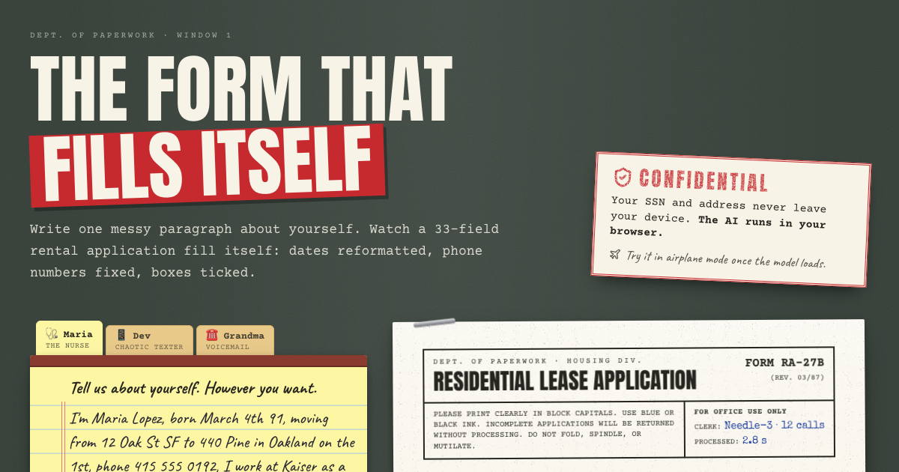
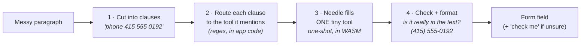

# The Form That Fills Itself

**Write one messy paragraph about yourself. Watch a 33-field rental application fill itself, with dates reformatted, phone numbers fixed and boxes ticked. The AI runs in your browser, so your SSN and address never leave your device.**



This is a small, self-contained example of **on-device tool calling** with [Cactus Needle 3](https://github.com/cactus-compute/needle), a 121M-parameter tool-calling model that fits in a 35 MB file. It runs on the CPU as WebAssembly. There is no server, no API key and no backend. After the model has downloaded once, you can turn on airplane mode and the form still fills.

```
"I'm Maria Lopez, born March 4th 91, moving from 12 Oak St SF to 440 Pine in Oakland on the 1st,
 phone 415 555 0192, I work at Kaiser as a nurse. been renting my place 6 yrs, it's just me + my dog
 Pepper, I make about 96k. SSN 123 45 6789 (don't tell anyone lol)"
```

becomes 18 filled fields from 12 tool calls, including:

| Field | Value |
| --- | --- |
| Name | Maria Lopez |
| Date of birth | 03/04/1991 ⚑ *'91' read as 1991* |
| SSN | 123-45-6789 |
| Phone | (415) 555-0192 |
| Present address | 12 Oak St, San Francisco, CA · ☒ Rent · 6 years |
| New address | 440 Pine, Oakland, CA |
| Move-in date | 10/01/2026 ⚑ *that date had already passed, so the next month was assumed* |
| Employer / title | Kaiser / Nurse |
| Monthly income | $8,000 ⚑ *no period was given, so $96,000 was read as per year* |
| Pets | ☒ Dog |

The ⚑ fields glow yellow with a **check me** tag that explains the doubt and offers "Looks right" or "Fix it". (The move-in date depends on today's date. This run was on 2026-09-28.)

## Quickstart

```sh
npm install
npm run dev        # http://localhost:5173
npm run build      # type-check + production build into dist/
```

It's a static site. Deploy `dist/` anywhere; it needs no special headers.

| Option | Effect |
| --- | --- |
| `?engine=mock` (or `VITE_ENGINE=mock`) | Swap in a regex stand-in with the same interface. Useful for UI work without the 35 MB download. Its timings are simulated. |
| `?lanes=1`…`4` | Force the number of parallel model instances. |

It needs a modern browser with WebAssembly and BigInt, and about 100 MB of free memory per lane.

## How it works, in plain terms

Needle is a *tool-calling* model. You give it a list of functions your app has (their names, what they do, what arguments they take) plus a user's words. It replies with JSON saying which function to call and with what arguments. It never writes free-form prose. A grammar compiled from your function schemas controls every token it generates, so the JSON always parses and always matches the schema.

A form is a natural fit. Each part of the form is a function (`set_phone(phone)`, `set_birth_date(date)`), and filling the form means calling those functions with values taken from the paragraph.

The catch is that Needle is *tiny*. It's trained on short requests like "set a timer for 10 minutes" or "dim the living room to 30", and it does its best work when the request is short and the tool is small. A 60-word life story compared against 21 tools is the opposite of that. So this app never shows Needle the whole problem. It cuts the problem into pieces the model is good at:



1. **Cut the paragraph into clauses.** Each clause holds about one fact, the length Needle was trained on.
2. **Route each clause to the tools it mentions.** Plain regexes decide that "phone 415 555 0192" is for `set_phone`. This is the step we tried to hand to the model and couldn't (see [what we learned](#what-we-learned-about-needle-3)).
3. **Ask Needle to fill one tiny tool from one clause.** Every call declares a single tool with 1–3 arguments and starts a fresh conversation.
4. **Check its answer and format it.** The app throws away any value that doesn't appear in the clause. Then plain code does the formatting: phone numbers, dates, title case, monthly income.

### One real call, end to end

This is an actual call and response from Needle 3 (20 layers, WebAssembly), not a mock.

**The tool schema the model sees.** It is the only tool declared for this call:

```json
{
  "name": "set_phone",
  "description": "Record the applicant's phone number.",
  "parameters": {
    "type": "object",
    "properties": { "phone": { "type": "string" } },
    "required": ["phone"]
  }
}
```

**The system prompt** is facts only. Needle treats it as context and never as instructions:

```
date: 2026-09-28 Mon; locale: en-US
```

**The input** is one clause: `phone 415 555 0192`

**What Needle returns** (229 ms, about 290 tokens/s decode on a laptop CPU):

```json
{
  "type": "call",
  "function_calls": [{ "name": "set_phone", "arguments": { "phone": "415 555 0192" } }],
  "suppressed_calls": [],
  "reasoning": "'415 555 0192' -> phone '415 555 0192'. No other fields.",
  "confidence": 0.8513,
  "validation": { "ungrounded": [], "negation": false }
}
```

**Then the app** checks that those digits really appear in the clause and formats them as `(415) 555-0192`. The confidence is above the threshold and nothing was held back, so the field gets no flag.

In the browser this runs in a Web Worker ([public/needle-worker.js](public/needle-worker.js)) that calls Needle's C API, compiled to WebAssembly:

```js
needle_init(systemPrompt, toolsJson, 0)            // compile the grammar and prefix for this tool set
needle_reset()                                     // one-shot: forget the previous call
needle_complete(clause, maxNewTokens, out, cap)    // → the JSON envelope above
```

---

## Shaping the input: paragraph → clauses

[`src/extract/clauses.ts`](src/extract/clauses.ts) turns the paragraph into request-sized pieces:

- It splits on sentence ends and on emoji (people use 😩 as a full stop).
- It cuts sentences at commas, `+`, `;`, "but", "or", and before phrases like "to 440…", "on the 1st" and "by nov 15th".
- It **merges fragments that continue the previous one** ("unit B", "in Santa Cruz", "is 831-555-0178") and fragments that no tool cares about, so an address or an emergency contact stays in one piece.
- It drops filler ("yo", "hey", "um"), spelled-out names ("that's W-H-I-T-F-I-E-L-D") and emoji.
- It keeps character offsets, so the legal pad can highlight the clause being read at that moment.

Maria's paragraph becomes 11 clauses and 12 calls:

```
"I'm Maria Lopez"                              → set_name
"born March 4th 91"                            → set_birth_date
"moving from 12 Oak St SF"                     → set_current_address
"to 440 Pine in Oakland"                       → set_new_address
"on the 1st"                                   → set_move_in_date
"phone 415 555 0192"                           → set_phone
"I work at Kaiser as a nurse"                  → set_job
"been renting my place 6 yrs, it's just me"    → set_tenure, set_years_there
"my dog Pepper"                                → set_pet
"I make about 96k"                             → set_income
"SSN 123 45 6789 (don't tell anyone lol"       → set_ssn
```

## Feeding the tool schemas

The whole form is **21 tiny tools** in [`src/extract/tools.ts`](src/extract/tools.ts). These rules came from testing, not from guesswork:

| Rule | Why |
| --- | --- |
| **One tool per call**, never the whole catalog | Needle fills one small tool very reliably. It picks badly among our 21 "Record X" tools (see below). Cactus's own extraction guide takes the same approach: *"extraction is tool calling with exactly one tool."* |
| **1–3 arguments per tool** | Multi-field tools (a whole "applicant" record) produced partial or empty calls. |
| **No `pattern` or `format` on free text** | Forcing `(415) 555-0192` while the model wants to copy `415 555 0192` stalls the decoder until the token budget runs out. Format in app code instead. |
| **Dates are asked for "as written"** | Given a `date:` fact, the engine re-anchors partial dates, so `11/22/98` became *this year*. Birth dates get no date fact, and the app parses the phrase itself. |
| **Enums use words people say** | `"lease is up"`, `"full-time"`, `"live with family"`, not `lease_end` or `FT`. The app maps them to form values afterwards. |
| **Descriptions show the expected shape** | `"Street address, e.g. '12 Oak St'"`. The model copies what it sees. |
| **Only give today's date when it helps** | "by nov 15th" and "on the 1st" need it. A birth date is hurt by it. |

**Speed.** `needle_init` compiles each tool set once (about 0.2 s). The planner groups calls by tool, so each engine *lane* runs init once per tool and then only runs completions. On devices with 4 or more cores and 4 GB or more of memory, two model instances (lanes) run in parallel Web Workers, and each takes about 100 MB. Batches go out in form order, so fields fill from top to bottom.

## The trust layer: when to say "check me"

A small model that sounds confident is dangerous on a form that asks for an SSN. [`src/extract/interpret.ts`](src/extract/interpret.ts) applies one policy:

- **Invented values are dropped, never shown.** Every value must be *grounded* in its clause: its words appear there, the phone or SSN digits appear there, the number appears as digits or as a word ("two of us"). The form never displays text you didn't write.
- **A value gets flagged ⚑ when:**
  - the engine **held it back** (Needle returns low-confidence calls in `suppressed_calls` instead of `function_calls`),
  - its confidence is **below 0.12**,
  - the parser had to **assume** something (`'91' read as 1991`, "no period given, so $96,000 was read as per year", "Thanksgiving, taken as the holiday itself"),
  - or a **plausibility** check fails (an age under 18 or over 110, a malformed email).
- A **section** whose average confidence is below 15% gets a "check this section" note.
- A floating ⚑ chip walks you through every flag in turn. You can clear each one with "Looks right" or by editing the field.

Needle's calibrated confidence is honest, but it runs low. Correct extractions often score only 0.1–0.4, which is why the threshold sits at 0.12 and the grounding checks do most of the work.

---

## What we learned about Needle 3

### Needle *can* route. It just doesn't route this kind of input.

Cactus's sandbox demos ("dim the living room to 30", "text Ada happy birthday and call her") pick correctly from 14–27 tools. We wanted the model to do our routing too, so we measured both setups on the same WASM build:

| Setup | Result |
| --- | --- |
| Cactus's 27-tool catalog, its own preset **commands** | **8 / 8** correct tool, confidence 0.3–0.8 |
| Our 21 form tools, each of our 38 routed **clauses** | **9 / 38** agreed with our router · 9 picked a different tool · 20 made no call |
| Our 21 form tools, the **whole paragraph** in one call | **no call at all**, for all three examples |

Why the living room works so well and a life story doesn't:

- **Commands versus statements.** "Dim the living room" is a request to *do* something. "dob 11/22/98" is a fact about a person. Needle is trained on requests, and it routes by matching the *action* in the words to a tool name. Our clauses contain no action.
- **Distinct actions versus near-identical tools.** `set_lights`, `lock_door` and `play_music` are clearly different things. Our tools are all "Record the applicant's ___". Choosing between `set_phone` and `set_emergency_contact` depends on subtle content, not on a verb.
- **The demos lean on `triggers`.** Many sandbox tools declare regex `triggers`, and the engine uses them to restrict decoding to the matching tools. Routing by pattern is part of how the official demos work, and it's the same idea as our router in app code.
- **Tool retrieval isn't in this release.** The docs describe keeping only the top 5 of a large catalog by embedding similarity. But Cactus's [notes for runtime authors](https://cactuscompute.com/blog/porting-needle) say the released `needle3.cact` has no embedding head, and the published checkpoint confirms it: it holds only a confidence head. So every declared tool goes into the prompt, and Cactus notes that accuracy falls past roughly two dozen tools. `needle_embed` still returns a vector (built from the confidence head's features), but as a tool shortlister it put the right tool in the top 5 for only 29 of our 40 clauses.

### Things we tried that didn't help

| Idea | Routing over 21 tools (40 clauses) |
| --- | --- |
| Raw clause, current tool names (what the app declares) | **9** right · 11 wrong tool · 20 no call |
| Frame each clause as a command: "Fill in my rental application: …" | 5 right · 30 no call |
| Distinct, namespaced tools (`applicant_phone_number`, `new_home_move_in_date`…) | 6 right · 32 no call |
| Both | 3 right · 33 no call |

A command that no tool performs makes Needle answer "nothing to call", which is correct behaviour for a tool-caller. More descriptive names made it more cautious rather than more accurate: fewer wrong picks, but far more refusals. Inside the one-tool pipeline, prefixing a field-specific command ("Save my phone number: …") raised the average confidence from 0.45 to 0.52, but it lost two fields and turned "around Thanksgiving" into today's date. The app still sends the raw clause.

That's why our app does the *routing* in regexes and uses the model for the *reading*: pulling the right span out of messy text, turning "96k" into `96000`, choosing `"lease is up"` from an enum, and reporting how sure it is.

### Other findings

- **Keep inputs short.** Performance drops sharply beyond a single clause.
- **A `pattern` that requires reformatting stalls decoding** ("token budget exhausted"). Let the model copy the text, then format it yourself.
- **A `date:` fact re-anchors partial dates**, so `11/22/98` gets moved to the current year. Ask for dates "as written" and parse them in code.
- **The word "don't" can trip Needle's negation gate.** The gate exists so that "don't turn on the lights" makes no call, but it can also fire on clauses where the negation is incidental.
- **Spoken digits** ("four one five…") don't extract reliably.
- **Holidays come back empty.** "around Thanksgiving" returns no date, so a form rule fills it and flags it.
- **Speed:** about 0.2–0.5 s per call on a laptop CPU, about 290 tokens/s decode, and about 97 MB of WASM heap per instance. A whole example (12–18 calls) takes about 5–7 s on one lane, less with two. The browser build is single-threaded CPU only: no WebGPU, no streaming, and no COOP/COEP headers needed.

---

## Privacy: what actually crosses the network

| When | What | From |
| --- | --- | --- |
| Page load | The app (HTML, JS, CSS, fonts, images) | Your host (for example Vercel). Fonts are bundled, with no Google Fonts calls |
| First visit | `needle.js`, `needle.wasm`, `needle3.cact` (36 MB) | Hugging Face, [pinned revision](src/engine/needleEngine.ts), saved in Cache Storage |
| **While filling** | **Nothing** | |

Your text is only ever passed to a Web Worker on your own machine. The receipt's "bytes sent" figure is **measured, not asserted**: a `PerformanceObserver` counts every network request made during the fill. Visitors with Data Saver turned on download the model only when they first press Fill.

---

## Project map

```
src/
  extract/
    clauses.ts      paragraph → short clauses (with offsets for highlighting)
    tools.ts        the 21 tiny tool schemas + the regex router
    pipeline.ts     plan (clause × tool) batches, run them across engine lanes
    interpret.ts    Needle envelope → form values; grounding + "check me" policy
    normalize.ts    deterministic formatting: dates, phones, SSN, addresses, money
  engine/
    needleEngine.ts download + cache the model, spawn workers, RPC
    mockEngine.ts   stand-in engine for UI work
    types.ts        the Needle envelope and engine interface
  form/schema.ts    the 33 form fields (single source of truth)
  hooks/            useEngine (loading), useFormFiller (the fill state machine)
  components/       the paper form, legal pad, receipt, Post-its
public/
  needle-worker.js  one Needle instance per Web Worker
```

Open **"Carbon copy: the raw tool calls"** under the form to see every clause, the tool it went to, and the model's full JSON envelope.

## Credits

- **[Needle 3](https://huggingface.co/Cactus-Compute/needle3)** by [Cactus Compute](https://cactuscompute.com) (Apache-2.0). This project downloads it at runtime and doesn't redistribute it.
- Fonts: Special Elite (Apache-2.0), Courier Prime, Caveat and Anton (OFL-1.1), self-hosted via [Fontsource](https://fontsource.org).
- Built with React, Vite, Tailwind CSS, react-hot-toast and Lucide.
